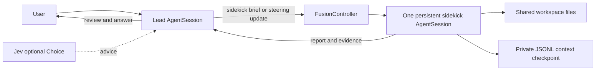

# Design and provenance

This package is an independent Pi implementation of the lead/sidekick architecture observed in the user’s installed Devin CLI. It does not reproduce Devin’s Rust source, model-selection backend, billing service, or proprietary scheduling internals.

## Evidence

The local executable resolves to Devin CLI version directory `3000.11.3`. Identified UTF-8 string spans include a lead template, a sidekick template, sidekick tool-description fragments, first-message/first-edit reminders, grounding guidance, handoff/update text and conditional template fragments. `resources/devin-original/manifest.json` records the binary SHA-256, byte offset, byte length and hash of each extracted file. Original punctuation is preserved; this is more faithful than the earlier ASCII `strings` output.

Static literals establish that the program contains these instructions and messages. They do not establish which conditional branch is active for a particular model pairing. `src/prompts.ts` documents the selected fragments and performs substitutions. Source files remain unchanged. The Pi compatibility appendix overrides unavailable capabilities such as persistent shells, browser tools, skills and Devin authority APIs.

The tool description is two UTF-8 literals separated by four non-text bytes in this build. Both literals and the gap are recorded separately. The adapter explicitly inserts `read_sidekick` between them; it does not pretend that name was present in the binary.

## Runtime

`controller.ts` owns a serialized dispatch gate, one active job, a reusable driver, waiter ownership, deadline cancellation and one-time background notification. A second dispatch steers the existing job. A wait timeout transfers notification ownership to the background path. An explicit interrupt cancels work and suppresses an automatic wake.

`sidekick.ts` creates an SDK session with selected built-in tools. It reuses the same session between handoffs. Provider registrations are copied from the lead registry; extension factories and orchestration tools are not loaded in the child. Steering is queued at Pi tool boundaries. Shell invocations remain ordinary Pi bash calls.

Child checkpoints are captured after complete turns and final settlement, not halfway between an assistant tool call and its result. Parent custom entries save the checkpoint and configuration on the active parent branch. Opening a saved checkpoint copies only its ancestor path into a new child session file. The old file is not mutated, so parent forks do not share a writer or read future child context. File-system changes are shared and are not rolled back by conversation navigation.

Lead policy is registered as the sidekick tool’s promptGuidelines. It stays present during background wakes even when before_agent_start is skipped. First-message guidance and one-time direct-edit reminders use the extracted texts. They are prompt guidance, not semantic access controls.

## Usage and state

The child reports SDK usage from newly added branch entries, including reported compaction/retry usage. Pending usage is consumed once by a blocking tool result or read_sidekick. Reading the same report twice does not double count it. Background notices do not carry usage; the lead must read the report to transfer usage into parent session totals.

Parent checkpoints store usage from completed child turns to recover partial work after a crash. An abrupt process termination may still lose events since the last checkpoint. API usage and catalog pricing are estimates, not authoritative invoices.

Fusion preferences are global and per-agent-dir: `<agentDir>/fusion/config.json` (honouring `PI_CODING_AGENT_DIR`) stores only `version`, `enabled` and a whitelist of `FusionConfig` fields (model, thinking, tools, timeoutMs, maxTurns, reminders, routing). Credentials are never written. A fresh session with no saved branch state inherits those defaults; a restored branch entry always wins, so resuming a saved session is stable even if defaults change later. `model`, `on`/`off`, `thinking`, `tools`, `timeout`, `turns`, `reminders` and `routing` persist preferences after a successful command; `stop`, `reset`, `status`, shutdown, reload and runtime progress do not. Resuming a legacy saved session that selected a model while no global file exists migrates that configuration once, using an atomic same-directory replacement that never overwrites a concurrent creator. An unreadable or invalid file warns and falls back to initial defaults without blocking the session. Sidekick checkpoints, last handoff, Jev advice, reminders and all usage accounting stay branch-scoped and never enter the global file.

## Display

The below-editor widget always shows lead and sidekick labels. Parent turn/message events and child turn/message events drive independent activity flags. Both can be bright during concurrent inference; idle labels are dim. It uses the active Pi theme and terminal-width helpers, wraps into two rows on narrow terminals, and leaves the standard footer intact.

## Jev

Jev is optional and off by default. One Choice selects lead, sidekick or uncertain from the current user request and fixed role descriptions. No whole conversation, codebase or original Devin prompts are sent. Requests use only the TYPESAFE_API_KEY environment variable and have a four-second timeout with zero retries. The result supplies advice; it neither replaces the lead nor executes a handoff on its own.

The sidekick recommendation gate requires confidence >= 0.8 and sidekick probability >= 0.85. These are conservative heuristic thresholds tested on a tiny synthetic smoke set, not calibrated correctness guarantees. Errors, ambiguity and oversize inputs return control to the lead. Structured telemetry records model version, duration, token use and probabilities without request payloads or credentials.

Live references: [TypeSafe API](https://docs.typesafe.ai/api), [Choice](https://docs.typesafe.ai/primitives/choice), [Intent routing](https://docs.typesafe.ai/patterns/intent-routing), [Confidence](https://docs.typesafe.ai/confidence), [Function calling cookbook](https://docs.typesafe.ai/cookbooks/function_calling).

## Validation scope

Checked against Pi 1.0.3. Tests use the actual SDK with a scripted offline provider for tool execution, interruption, persistence, background wakes and accounting. Each preference scenario opens an independent AgentSession so default inheritance, branch precedence, one-shot migration and corrupt-file recovery are observed the way a user relaunch behaves. The 10-case Jev smoke evaluation is a real service call using only synthetic inputs. This is not a comparison of task quality or spending against Devin.
