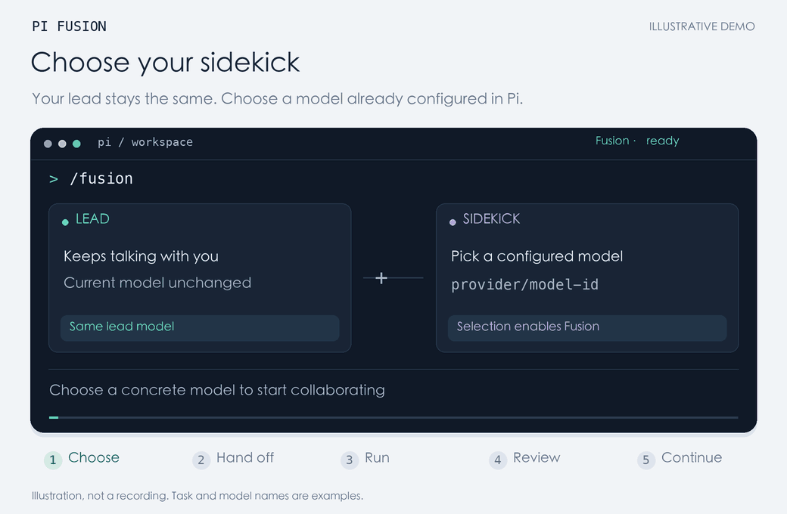

# Pi Fusion

<p align="center">
  <strong>Persistent Lead / Sidekick Dual-Model Orchestration for Pi</strong><br>
  Inspired by Devin Local Fusion
</p>

<p align="center">
  <a href="https://www.npmjs.com/package/pi-local-fusion"></a>
  <a href="https://nodejs.org"></a>
  <a href="LICENSE"></a>
  <a href="https://pi.dev"></a>
</p>

<p align="center">
  <strong>English</strong> | <a href="README.zh-CN.md">简体中文</a>
</p>

---

## 💡 Why Pi Fusion?

When developing with AI coding agents, developers often face an awkward trade-off:

- **A single massive model doing everything**: Frontier reasoning models (e.g. Claude 3.7 Sonnet / Opus) excel at architectural decisions, high-level planning, and rigorous reviews. However, having them search through files, run unit tests, and tweak syntax burns expensive reasoning tokens and floods the lead conversation with noisy terminal outputs.
- **Ordinary ephemeral subagents**: While subagents can handle bounded grunt work, each dispatch usually starts with a **blank, clean slate**. They do not retain conversation history across tasks, requiring repetitive context re-establishment; and once spawned, they run as black boxes without in-flight steering.

**Pi Fusion provides a persistent, dual-agent alternative:**
Inside a single workspace, it establishes an enduring **Lead + Sidekick** partnership.

- 🧠 **The Lead (your current Pi model)**: Maintains high-level architectural awareness, chats with you, formulates handoff briefs, and critically audits the sidekick's code diffs and test results.
- 🛠️ **The Sidekick (a dedicated worker model you configure)**: A long-lived, singleton background worker that handles bounded implementation, repository search, and test verification using an economical, code-focused model.

### 🌟 Key Differences & Advantages

| Feature | Conventional Subagents | Pi Fusion Persistent Sidekick |
| :--- | :--- | :--- |
| **Session Memory** | Cleared on every call; forgets previous turns | **Retains private child context** across handoffs |
| **In-flight Steering** | Black box once started; cannot adjust mid-run | **Inject steering updates dynamically** at tool boundaries |
| **Execution Flow** | Blocking wait or polling loops | **Seamless foreground wait & background continuation** |
| **Context Hygiene** | Pollutes lead context or forces duplication | **Strict context isolation** keeps the lead clean |
| **Usage Accounting** | Fragmented or double-counted | **Counted once** when the lead claims the final report |

> ℹ️ *Note: Pi Fusion is an independent community extension and is not affiliated with or endorsed by Cognition or Devin. See [License and Provenance](#-license-and-provenance).*

---

## 🎬 Workflow Demo

Choose a model → Hand off work → Runs in background → Review diff & evidence → Continue across tasks.

<p align="center">
  
</p>

<p align="center">
  <em>~22-second looping demo illustrating the dual-model interaction rhythm. <a href="docs/media/workflow-en.png">View static contact sheet</a></em>
</p>

---

## 📋 Requirements

- **Node.js**: `>=22.19.0`
- **Pi**: Tested with Pi 1.0.3+
- **Sidekick Provider & Credentials**: A provider and model already configured in Pi with valid API credentials.

---

## 🚀 Quick Start

### 1. Install the Extension

Pi Fusion is published on npm as [`pi-local-fusion`](https://www.npmjs.com/package/pi-local-fusion). Install via Pi:

```bash
pi install npm:pi-local-fusion
```

The package includes the `pi-package` keyword for seamless discovery in the [Pi package gallery](https://pi.dev/packages).

<details>
<summary>Alternative Installation (from GitHub or local clone)</summary>

From GitHub repository:
```bash
pi install git:github.com/BUKOWSKIREAL/pi-fusion
```

From a local checkout, run in its parent directory:
```bash
pi install ./pi-fusion
```
</details>

### 2. Enable & Select a Sidekick Model

In your Pi terminal session, run:

```text
/reload
/fusion
```

- On first launch, `/fusion` directly opens the interactive **model picker**. Choose an existing configured model; Fusion turns on immediately and persists this choice as your default.
- **Your lead model remains unchanged**: Pi's native `/model` command still controls the lead. Use `/fusion-model` to switch the sidekick at any time. (Virtual router models are filtered out because the sidekick requires a concrete physical model).

### 3. Delegate Tasks in Plain Language

You never need to invoke raw tool calls manually. Speak directly to the lead:

```text
Add CSV export to the reports page. Settle the architecture first, then hand the
implementation and unit tests to the sidekick. Review the full diff and test output
before reporting back to me.
```

The lead will draft a bounded brief, call the `sidekick` tool, wait for results or let it run in the background, and perform a code audit before presenting the final answer.

---

## ⚙️ How It Works Under the Hood

Pi Fusion hooks deeply into Pi's AgentSession architecture to ensure production-grade reliability:

### 1. One Persistent Sidekick Session
There is strictly one sidekick worker per lead session. The sidekick preserves its own history across dispatches. When the lead delegates follow-up work, it simply sends incremental instructions—the sidekick already knows the code structure and previous test results.

### 2. In-flight Steering
If requirements change while the sidekick is running a prolonged build or search, the lead can send another message. Rather than spawning a competing worker or aborting work, the message is queued as a **steering update** and safely injected at the next tool boundary.

### 3. Foreground Wait & Seamless Background Continuation
- **Fast tasks finish in foreground**: Blocking handoffs wait up to 60 seconds by default. If the sidekick finishes quickly, the lead receives the report immediately.
- **Long tasks degrade gracefully**: If the 60-second timer elapses, the work **continues running in the background**. The lead is freed up to converse with you, and receives a non-intrusive wake notification when the sidekick finishes.
- **Inspect & cancel**: The lead can await results using `read_sidekick` (up to 300s) or abort anytime via `stop_sidekick`.

### 4. Strict Context Isolation with Shared Workspace
- **Context Isolation**: The sidekick only receives explicit handoff briefs, its private transcript, and workspace instruction files (such as `AGENTS.md`). It never sees your complete chat history with the lead.
- **Shared Files**: Both models operate in the same physical repository directory. The lead avoids touching files currently being edited by the sidekick. Pi session tree navigation does not roll back disk changes.

### 5. Accurate Single-Claim Accounting
Token usage and billing metrics incurred by the sidekick are only folded into the parent session when the lead **receives a blocking result** or **calls `read_sidekick`**. Background completion notices carry zero cost, and reading the report multiple times never double-counts.

### 6. Minimal Safe Child Runtime
The sidekick is sandboxed to Pi's built-in core tools:
- `coding` mode (default): `read`, `grep`, `find`, `ls`, `edit`, `write`, `bash`;
- `readonly` mode: `read`, `grep`, `find`, `ls`.
It does not inherit lead extensions, MCP servers, or custom skills. Each bash call executes as an independent OS process with current user permissions.

---

## 📖 Command Reference

Type `/fusion` to open the quick settings view (toggle state, view active sidekick, inspect runtime details).

### Everyday Commands

| Command | Description |
| :--- | :--- |
| `/fusion` | Open settings view (or open model picker directly on first run) |
| `/fusion-model` | Shortcut to open the model picker and select/change the sidekick |
| `/fusion status` | Inspect runtime status: active model, limits, config file paths, last handoff usage |
| `/fusion stop` | Abort the active sidekick run; **preserves child context and file changes** |
| `/fusion off` | Abort active work and turn Fusion off; remembered across restarts |
| `/fusion on` | Turn Fusion on (opens model picker if no default model is set) |
| `/fusion help` | List all available Fusion commands |

> 💡 **Tip**: Run `/fusion stop` to ensure the sidekick is idle before altering sidekick models or core limits.

### Advanced Configuration & State Management

| Command | Arguments & Defaults | Purpose & Mechanism |
| :--- | :--- | :--- |
| `/fusion model <provider/model-id>` | Full model ID | Manually set the global default sidekick and turn Fusion on |
| `/fusion assign <provider/model-id>` | Full model ID | **Branch-only override**: switches the physical sidekick model on the current branch without modifying global defaults |
| `/fusion compact` | None | Manually compact the idle sidekick's history; **pins and preserves all delivered handoff texts verbatim** |
| `/fusion reset` | None | **Drop the child context pointer**; the next handoff starts with a fresh session (files and session logs remain on disk) |
| `/fusion thinking <level>` | `off`, `minimal`, `low`, `medium` (default), `high`, `xhigh`, `max` | Configure sidekick thinking budget (subject to model support) |
| `/fusion tools <mode>` | `coding` (default) / `readonly` | Set sidekick toolset; use `readonly` for pure auditing/research |
| `/fusion timeout <minutes>` | `1`–`240` min (default `15`) | Maximum runtime deadline per handoff |
| `/fusion turns <count>` | `1`–`1000` turns (default `80`) | Maximum tool turns per handoff |
| `/fusion reminders <on\|off>` | `on` (default) / `off` | Toggle one-time reminder injection for first message & lead direct edits |
| `/fusion routing <jev\|off>` | `jev` / `off` (default) | Toggle optional TypeSafe Jev routing advisory |

> ⚠️ **Regarding `/fusion reset`**: `reset` is a destructive action for child context. Use it only when you intentionally want the sidekick to forget past interactions, or after significant workspace structural shifts.

---

## 💾 Storage & State Persistence

Global configuration defaults are saved at:

```text
~/.pi/agent/fusion/config.json
```

Child session transcripts are stored at:

```text
~/.pi/agent/fusion/sessions/
```

*(If `PI_CODING_AGENT_DIR` is set, these paths relocate under that directory automatically. Run `/fusion status` to check active paths).*

### Persistence Rules
1. **Global Configuration (`config.json`)**: Persists enabled state, default model, thinking budget, tool mode, timeouts, turns, reminders, and routing. Updated atomically upon successful command execution and inherited by fresh sessions.
2. **Branch State Precedence**: If a session branch contains existing Fusion state (such as branch-level `/fusion assign`, context checkpoints, or usage), that branch state always takes precedence over global defaults. Resuming past branches remains strictly reproducible.
3. **Credential Safety**: Authentication keys remain exclusively in Pi's provider auth or environment variables. Fusion never writes credentials to disk.

---

## 🧭 Status Display & Troubleshooting

When Fusion is active, the Pi status bar displays `Fusion · <state>`:
E.g., `ready`, active step progress, `completed`, `failed`, or `cancelled`.

Below the text editor in the TUI, a dedicated status widget displays the **Lead and Sidekick models side-by-side**, highlighting whichever agent is currently inferring or executing tools.

### Troubleshooting Guide

| Issue / State | Root Cause | Recommended Action |
| :--- | :--- | :--- |
| **`Fusion · failed`** | Indicates the **most recent handoff failed**, typically due to reaching turn limits or encountering provider rate limits. **This does not mean the extension is broken.** | Ask the lead to run `read_sidekick`, or open the sidekick session file directly via `pi --session <path>` to diagnose. |
| **Status persists as `failed` after `/reload`** | The status faithfully preserves the state of the last completed job until a new handoff is initiated. | No action required; sending a new task to the sidekick will refresh the status. |
| **Need to abort runaway work** | The sidekick is stuck in an expensive compile or deep recursion. | Press `Esc` during blocking wait or type `/fusion stop`. Context will be preserved. |
| **Command name collisions** | Another extension has registered conflicting `/fusion` or `sidekick` tools. | Disable the competing extension in Pi settings. |

---

## 🧠 Optional Feature: Jev Routing Advice

Jev routing is optional and disabled by default. The lead model is inherently capable of task delegation decisions.

To receive supplemental semantic classification advice powered by [TypeSafe](https://docs.typesafe.ai):

1. Export `TYPESAFE_API_KEY` in your environment.
2. Enable routing in Pi:
   ```text
   /fusion routing jev
   ```

### Architecture & Privacy Boundaries
- **Advisory Only**: Advice is provided to the lead as context. The lead makes the final decision on whether to delegate and authors the handoff brief.
- **Conservative Gating**: Recommends sidekick only when predicted role is `sidekick`, confidence $\ge 0.8$, and probability $\ge 0.85$. Any ambiguity, network error, or timeout automatically falls back to lead handling.
- **Strict Privacy**: Dispatches only the user's latest prompt text (up to 8,000 characters) and fixed role descriptions. **No repository code, full conversation history, or credentials are ever sent**.
- **Performance & Billing**: Calls time out strictly at 4 seconds with 0 retries. Jev token metrics are shown in `/fusion status` and kept distinct from `/cost`.

---

## 🛠️ Development & Testing

Pi Fusion includes a comprehensive offline test suite covering SDK orchestration, concurrency gates, compaction preservation, and preference migrations (53 tests):

```bash
# Install dependencies
npm ci --ignore-scripts

# Type check
npm run check

# Run complete test suite
npm test
```

> 💡 All unit tests run against the genuine Pi SDK with an offline scripted mock provider, **incurring zero paid API costs**.

### Source Tree Overview

```text
src/
  index.ts         Extension entry: commands, tool declarations, status hooks
  controller.ts    Serialized dispatch gate, steering, timeout degradation, usage claims
  sidekick.ts      Child AgentSession wrapper, checkpoint persistence, tool filters
  state.ts         Branch state and default fallback management
  preferences.ts   Atomic read/write for global config.json
  router.ts        Optional TypeSafe Jev routing adapter
  prompts.ts       Prompt assembly & compatibility bridges
  display.ts       Side-by-side TUI status widget
test/              Offline SDK & lifecycle unit tests
evaluation/        Jev smoke test evaluation dataset
resources/         Reference prompt manifests and templates
```

For deeper architectural details, refer to:
- [Architecture & Verification Scope (DESIGN.md)](DESIGN.md)
- [Devin Fusion Engineering Reconstruction Comparison (docs/DEVIN_FUSION_ENGINEERING.md)](docs/DEVIN_FUSION_ENGINEERING.md)

---

## 📄 License and Provenance

Pi Fusion is an independent open-source extension and is not affiliated with, endorsed by, or published by Cognition or Devin.

- The independently authored extension code is licensed under the [MIT License](LICENSE).
- The MIT License **does not cover** files within `resources/devin-original/` or the original prompt text reproduced at runtime. These materials remain third-party artifacts, and this repository claims no copyright or redistribution rights over them.
- For complete details, see [THIRD_PARTY_NOTICES.md](THIRD_PARTY_NOTICES.md) and [DESIGN.md](DESIGN.md).
