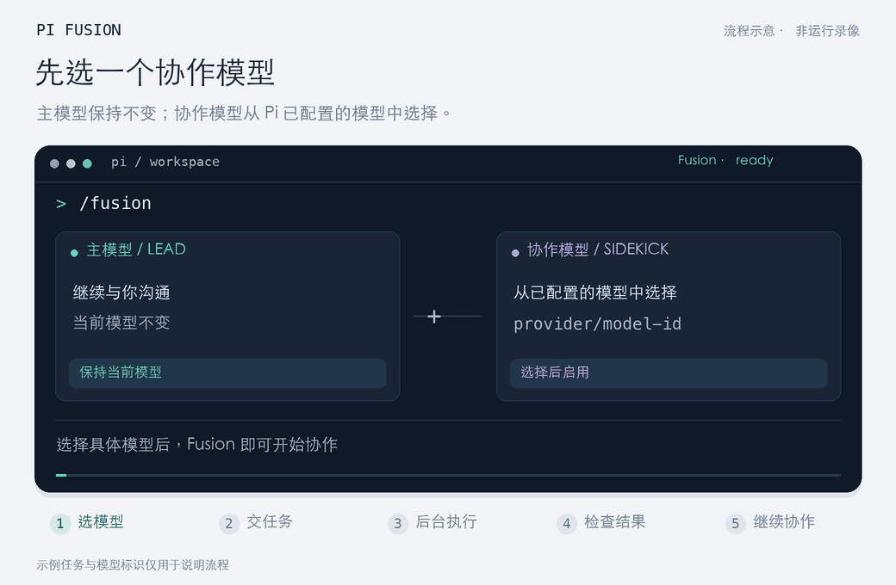

# Pi Fusion

<p align="center">
  <strong>为 Pi 打造的持久化双模型（Lead / Sidekick）协同工作流</strong><br>
  灵感源自 Devin Local Fusion
</p>

<p align="center">
  <a href="https://www.npmjs.com/package/pi-local-fusion"></a>
  <a href="https://nodejs.org"></a>
  <a href="LICENSE"></a>
  <a href="https://pi.dev"></a>
</p>

<p align="center">
  <a href="README.md">English</a> | <strong>简体中文</strong>
</p>

---

## 💡 为什么需要 Pi Fusion？

日常使用 AI 编程助手时，开发者常常在两种极端模式间权衡：

- **单一大模型包揽全部工作**：顶级推理模型（如 Claude 3.7 Sonnet / Opus）具备出色的全局架构把控与代码审查能力，但若让它频繁进行代码翻找、跑单元测试、微调语法细节，会快速消耗高昂的思考 Token，并让琐碎日志挤爆主会话上下文。
- **普通一次性子代理（Ephemeral Subagent）**：虽然可以分配粗重杂活，但每次调用都作为**全新的空白会话**启动。子代理不保留历史记忆，每次交接都需要重新铺垫上下文；且一旦启动就无法中途纠偏，稍有偏差只能全盘推翻。

**Pi Fusion 提供了第三种优雅解法：**
在同一个工作区内，构建长期共存的 **主脑（Lead）+ 协作副手（Sidekick）** 协同架构。

- 🧠 **主模型（Lead，你当前使用的 Pi 模型）**：保持高维度认知，负责与你沟通、推演技术方案、向副手下发精炼任务书（Handoff Brief），并在任务完成后严格审查代码 Diff 与执行证据。
- 🛠️ **协作副手（Sidekick，你所选配的独立模型）**：常驻后台的单例工作进程，专注于受限的代码实现、文件搜索与测试验证，用高性价比或代码专精模型稳定干活。

### 🌟 核心差异与优势

| 维度 | 普通子代理（Subagent） | Pi Fusion 持久副手 |
| :--- | :--- | :--- |
| **会话记忆** | 每次调用从零开始，遗忘前序工作 | **长效保留私有上下文**，后续任务直接接着干 |
| **动态干预** | 启动后即黑盒运行，无法中途调整 | **支持执行中动态追加指示（Steering）**，无缝修正方向 |
| **执行模式** | 往往只能阻塞等待或简单轮询 | **支持前台快速等待与后台静默运行**平滑流转 |
| **上下文健康度** | 容易污染主会话或带来重复开销 | **主副上下文严格隔离**，主会话保持精炼清爽 |
| **Token 与计费** | 统计分散或重复扣算 | **严格单次归集**，仅在领取最终报告时计入主会话 |

> ℹ️ *说明：Pi Fusion 是独立开发的开源扩展，与 Cognition / Devin 官方无隶属或合作关系。详见[许可与来源说明](#-许可与来源说明)。*

---

## 🎬 协作效果演示

选定模型 → 派发任务 → 后台自动执行 → 审查代码与证据 → 跨轮次持续协作。

<p align="center">
  
</p>

<p align="center">
  <em>全流程约 22 秒循环演示，展示真实的双模型交互节奏。<a href="docs/media/workflow-zh.png">查看高清静态截图</a></em>
</p>

---

## 📋 运行要求

- **Node.js**：`>=22.19.0`
- **Pi**：已在 Pi 1.0.3+ 环境中验证
- **副手模型凭据**：在 Pi 中已配置好至少一个具备可用 API 密钥的服务商与模型

---

## 🚀 快速开始

### 1. 安装扩展

Pi Fusion 已发布至 npm（包名为 [`pi-local-fusion`](https://www.npmjs.com/package/pi-local-fusion)）。在终端运行：

```bash
pi install npm:pi-local-fusion
```

包内已附带 `pi-package` 标签，支持通过 [Pi 包广场](https://pi.dev/packages) 检索。

<details>
<summary>其他安装方式（从 GitHub 或本地源码）</summary>

直接从 GitHub 仓库安装：
```bash
pi install git:github.com/BUKOWSKIREAL/pi-fusion
```

如果是本地开发的源码仓库，在其上一级目录运行：
```bash
pi install ./pi-fusion
```
</details>

### 2. 启用并选择副手模型

进入 Pi 终端会话，输入：

```text
/reload
/fusion
```

- 首次执行 `/fusion` 会**直接唤起模型选择器**。从你已配置凭据的模型列表中挑选一个作为默认副手模型，Fusion 随即自动启用并持久化该选择。
- **主模型完全不受影响**：Pi 原生命令 `/model` 仍用于掌控主模型；`/fusion-model` 则用于随时更换副手模型。副手需要真实执行推理，因此选择器会自动过滤虚拟路由器模型。

### 3. 自然语言派发任务

你无需手动调用任何底层 API 或工具名称，直接用自然语言向主模型提需求即可。例如：

```text
为报表页面增加 CSV 导出功能。先和我确定技术方案，然后将具体的实现代码
和单元测试交由协作模型完成。请在仔细审查副手生成的完整 Diff 和测试输出后，
再向我做最终汇报。
```

主模型理解后，会自动起草任务说明（Brief），调用 `sidekick` 工具委派任务，并在拿到副手回报的证据后进行代码审查与汇总。

---

## ⚙️ 核心机制解析

Pi Fusion 深入整合了 Pi 内部的 AgentSession 运行时，提供工程级可靠性：

### 1. 单例长效会话（One Persistent Sidekick）
每个主会话仅绑定一个持久存在的副手实例。副手完整保留跨轮次的调试记录、环境探测信息与实现思路。下一次交接时，主模型只需提出增量需求，副手即可心领神会。

### 2. 执行中动态追加（In-flight Steering）
如果副手在执行长时间任务时，主模型收到了新的业务调整或发现了遗漏细节，主模型可直接再次发送指示。新指示将作为**转向指令（Steering Update）**安全注入到当前运行中的副手上下文中，在下一个工具执行节点生效，而不会粗暴打断正在进行的文件写入或重新创建副手。

### 3. 前台阻塞与后台静默的无缝流转
- **短任务前台等待**：默认阻塞交接最多等待 60 秒。若任务在此时间内完成，主模型即刻收到完整报告；
- **长任务自动降级至后台**：若超过 60 秒，仅代表前台等待超时，副手**依然在后台静默运行**，完全不阻碍主模型与你进行其他对话。副手执行完毕后会自动向主模型发送一次性完成通知；
- **随时拉取与取消**：主模型可通过 `read_sidekick`（最多等待 300 秒）随时拉取后台成果，或通过 `stop_sidekick` 中止当前运行。

### 4. 上下文隔离与共享工作区
- **上下文纯净隔离**：副手只能看到主模型交接给它的说明书、自身历史记录以及工作区指令文件（如 `AGENTS.md`）。它看不到主会话的完整聊天记录，有效阻断上下文膨胀。
- **共享文件系统**：两方工作在同一个物理工作区内，因此主模型在副手执行期间应避免同时编辑同一份文件。会话历史导航不会自动回滚磁盘文件。

### 5. 精确的 Token 消耗与费用归集
副手执行所消耗的 Token 与费用，只有在主模型**实际接收到阻塞结果**或调用 **`read_sidekick` 读取报告时**，才会被一次性合并到主会话的总账单中。后台完成通知本身不计入账单；多次重复读取同一份报告绝不会重复扣费。

### 6. 轻量且受限的安全工具集
副手只加载 Pi 原生核心工具：
- `coding` 模式（默认）：拥有 `read`, `grep`, `find`, `ls`, `edit`, `write`, `bash`；
- `readonly` 模式：仅开放只读工具 `read`, `grep`, `find`, `ls`。
副手不会继承主模型的扩展、MCP 服务、自定义 Skills，有效防止次级工具陷入死循环。每次 Bash 命令均为独立的操作系统子进程，遵循当前系统权限。

---

## 📖 命令速查手册

日常使用仅需输入 `/fusion` 即可呼出简洁的设置面板（查看副手、开关切换与状态概览）。

### 日常高频命令

| 命令 | 说明与效果 |
| :--- | :--- |
| `/fusion` | 打开设置面板；首次使用时直接打开副手模型选择器 |
| `/fusion-model` | 快捷打开模型选择器，选择或更换副手模型 |
| `/fusion status` | 查看详细运行时状态：当前模型、配额上限、配置文件与会话文件路径、最近交接消耗 |
| `/fusion stop` | 立即取消当前运行中的副手任务；**保留副手已有上下文及已修改的文件** |
| `/fusion off` | 停止当前任务并关闭 Fusion 功能；系统会持久记住关闭状态 |
| `/fusion on` | 重新开启 Fusion（若尚未设定默认模型，则先打开选择器） |
| `/fusion help` | 查看全部可用命令及其简要说明 |

> 💡 **提示**：更换副手模型或调整重要运行时配置前，建议先使用 `/fusion stop` 确保副手处于空闲状态。

### 进阶与系统调优命令

| 命令 | 参数说明与默认值 | 用途与运作机制 |
| :--- | :--- | :--- |
| `/fusion model <provider/model-id>` | 完整模型标识符（如 `anthropic/claude-3-5-haiku`） | 手动设置全局默认副手模型并启用 Fusion |
| `/fusion assign <provider/model-id>` | 完整模型标识符 | **仅针对当前会话分支**临时指定副手物理模型，保留副手上下文且不更改全局默认配置 |
| `/fusion compact` | 无参数 | 压缩处于空闲状态的副手上下文；系统会**逐字保留所有已送达的任务交接文本** |
| `/fusion reset` | 无参数 | **停止副手并彻底解绑其上下文指针**；下次任务将启动全新对话（工作区文件与磁盘历史文件仍保留） |
| `/fusion thinking <level>` | `off`, `minimal`, `low`, `medium`（默认）, `high`, `xhigh`, `max` | 设置副手的思考强度等级（受模型实际支持程度限制） |
| `/fusion tools <mode>` | `coding`（默认）/ `readonly` | 切换副手可用工具集；`readonly` 适用于纯检索或代码初审 |
| `/fusion timeout <minutes>` | `1`–`240` 分钟（默认 `15`） | 单次任务交接的总时限 |
| `/fusion turns <count>` | `1`–`1000` 轮（默认 `80`） | 单次任务交接的最大工具交互轮数上限 |
| `/fusion reminders <on\|off>` | `on`（默认）/ `off` | 开启或关闭首条消息指导与主模型首次直接编辑时的温和提醒 |
| `/fusion routing <jev\|off>` | `jev` / `off`（默认） | 开启或关闭基于 TypeSafe Jev 的意图路由建议 |

> ⚠️ **关于 `/fusion reset` 的说明**：`reset` 是破坏性操作，会断开副手的历史上下文记忆。仅在您明确希望副手“彻底忘掉过去重新开始”，或工作区结构发生剧烈重构时使用。

---

## 💾 配置文件与会话状态生命周期

Pi Fusion 的所有配置均保存在标准路径：

```text
~/.pi/agent/fusion/config.json
```

副手的持久化会话文件独立存储在：

```text
~/.pi/agent/fusion/sessions/
```

*若环境变量中设置了 `PI_CODING_AGENT_DIR`，以上路径会自动迁移至该目录下。可通过 `/fusion status` 随时查验实际路径。*

### 优先级与持久化规则
1. **全局配置（config.json）**：记录开关状态、默认模型、思考级别、工具集、超时上限、轮数上限、提醒开关及路由开关。任何通过相应命令进行的修改都会立刻写盘，供新会话继承。
2. **分支状态优先原则（Branch Precedence）**：如果某个现有会话分支中已有保存的 Fusion 状态（如副手历史、分支专有模型赋值 `/fusion assign` 等），该分支将始终优先恢复自身状态，不受全局默认值变动的影响，确保多分支切换绝对安全。
3. **敏感凭据安全**：API 密钥全部由 Pi 原生凭据系统或环境变量统一管理，Fusion 绝不向本地配置文件中写入任何密钥信息。

---

## 🧭 状态指示与排查指南

当 Fusion 处于激活状态时，Pi 的底部状态栏将展示 `Fusion · <状态>`：
例如：`ready`（空闲就绪）、具体的执行进度、`completed`（已完成）、`failed`（失败）或 `cancelled`（已取消）。

同时，在编辑器下方的 TUI 部件中，会**并排显示主模型与副手模型标识**，并以高亮形式清晰指示当前正处于哪个模型的推理周期。

### 常见状态排查

| 现象 / 状态 | 原因解析 | 应对建议 |
| :--- | :--- | :--- |
| **`Fusion · failed`** | 表示**最近一次交接任务未能顺利完成**，最常见原因是达到了最大轮数限制（turns limit）或上游模型服务商网络超时。**这并不代表扩展损坏或配置异常。** | 让主模型调用 `read_sidekick` 查看失败详情，或者在终端运行 `pi --session <会话文件路径>` 直接复盘副手会话。 |
| **重启或读取后仍显示 `failed`** | 此状态忠实记录最近一次交接的执行结果，直到发生下一次交接时才会刷新。 | 无需担心，向副手发起新的交接即可正常执行。 |
| **想要立即叫停副手** | 副手陷入了漫长的编译或搜索。 | 直接在等待期间按 `Esc` 键，或输入 `/fusion stop`。任务将安全中止，副手已有上下文予以保留。 |
| **多扩展命令冲突** | 若同时加载了其他注册了 `/fusion` 命令或 `sidekick` 工具的第三方扩展。 | 建议在 Pi 配置中停用冲突的扩展，避免工具调用混淆。 |

---

## 🧠 可选功能：Jev 意图路由建议

日常使用中无需开启 Jev，主模型自身足以做出清晰的分工判断。

若希望在用户提出新需求时，额外获得来自 [TypeSafe](https://docs.typesafe.ai) 的前置语义意图评估，可按如下步骤开启：

1. 在系统环境变量中设置 `TYPESAFE_API_KEY`；
2. 在 Pi 中执行：
   ```text
   /fusion routing jev
   ```

### 运作机制与隐私保障
- **纯建议性质**：Jev 的判断结果仅作为参考建议输入给主模型，主模型拥有最终决定权，绝不会绕过主模型直接派单。
- **极度保守的决策门限**：仅当分类结果为 `sidekick`、判定置信度 $\ge 0.8$ 且 sidekick 概率 $\ge 0.85$ 时，才会给出交接建议；其余任何情况（包括网络超时、不确定、输入超长）均默认交由主模型接管。
- **隐私保护**：每次仅发送用户当前输入的纯文本（截断至 8000 字符内）和固定的系统角色描述，**绝不传输项目源码文件、历史对话记录或认证凭据**。
- **超时与用量**：单次调用严格限制在 4 秒内且不进行重试；Jev Token 用量独立展示在 `/fusion status` 中，不混入主账单 `/cost`。

---

## 🛠️ 本地开发与测试

Pi Fusion 拥有严谨的自动化测试套件（覆盖 offline SDK 模拟、控制器并发、上下文紧缩、配置迁移等 53 项场景）：

```bash
# 安装依赖
npm ci --ignore-scripts

# 类型检查
npm run check

# 执行完整单元测试
npm test
```

> 💡 本地单元测试使用真实的 Pi SDK 配合离线 Mock Provider 运行，**不消耗任何真实的付费 API Token**。

### 核心源码目录概览

```text
src/
  index.ts         扩展入口：注册命令、Tools 工具定义、状态与生命周期 Hooks
  controller.ts    调度网关：处理单例任务门禁、转向指令 Steering、前后台切换、超时控制与用量汇总
  sidekick.ts      副手实现：封装子 AgentSession、检查点持久化与工具过滤
  state.ts         会话状态管理与默认配置推导
  preferences.ts   全局 config.json 的原子性读写与验证
  router.ts        可选的 Jev 意图路由适配器
  prompts.ts       提示词装配与兼容性适配
  display.ts       TUI 双模型并排状态显示组件
test/              脱机单元测试套件
evaluation/        Jev 路由 smoke 测试评估数据
resources/         参考提示词资源与清单
```

相关架构与深入解析可进一步参阅：
- [架构设计与工程验证范围 (DESIGN.md)](DESIGN.md)
- [Devin Fusion 工程还原度对照 (docs/DEVIN_FUSION_ENGINEERING.md)](docs/DEVIN_FUSION_ENGINEERING.md)

---

## 📄 许可与来源说明

Pi Fusion 属于独立开源项目，未获得 Cognition 或 Devin 的官方赞助、背书或发布。

- 本项目独立编写的扩展源码遵循 [MIT 开源许可证](LICENSE)。
- 许可证**不涵盖** `resources/devin-original/` 目录中的文本材料，以及扩展在运行时从这些文件中还原的原始提示词片段。此类材料属于第三方原有资产，本仓库不对其主张所有权或再授权权利。
- 详情请查阅 [THIRD_PARTY_NOTICES.md](THIRD_PARTY_NOTICES.md) 与 [DESIGN.md](DESIGN.md)。
