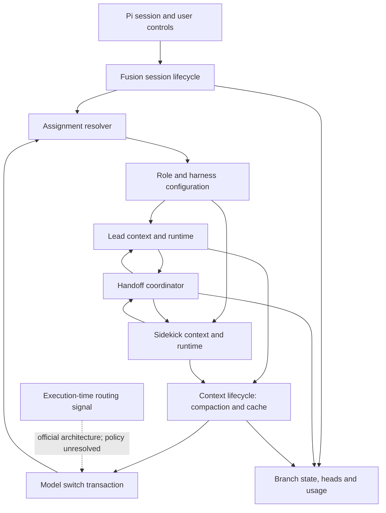

# Devin Fusion engineering reconstruction

This document defines the reconstruction target and the evidence needed to implement it. It is an engineering specification, not a claim that this repository already reproduces Devin Fusion.

The target is the observable Local Fusion machinery in Devin CLI `3000.11.3`, together with the dynamic routing architecture described in [Cognition's Fusion article](https://cognition.com/blog/devin-fusion#dynamic-routing). These sources describe different surfaces: a path compiled into the local CLI is not proof of cloud-harness behavior, and a cloud feature is not proof that this CLI build enables it.

The inspected binary SHA-256 is `7ef3859e68d4eabc0115e51898fcd4eab1edde753c27a472349ef551180b38ff`. Prompt provenance remains in [the original manifest](../resources/devin-original/manifest.json). Selected machine-code evidence and recovered symbol names are recorded in [the engineering evidence index](../research/devin-fusion/engineering-evidence.json).

## Fidelity rules

1. Reconstruct observable lifecycle, event ordering, context ownership and runtime behavior before adding model-selection heuristics.
2. Keep evidence from literal text, recovered symbols, inspected instructions, runtime observations and official descriptions distinct. Symbols and strings do not prove that an account executes a path.
3. An unknown server policy remains an unknown policy. An independently written local policy must identify itself as a replacement, even if its interface matches the original architecture.
4. Keep model identity, agent role and harness configuration separate. A stronger physical model does not acquire lead authority merely by answering inside the sidekick session.
5. Preserve the existing branch-safe checkpoints, settings persistence, cancellation behavior and usage accounting while the runtime is extended.
6. Do not treat the existing request-level Jev advice as Devin's dynamic router. No recovered evidence identifies Devin's allocation classifier as Jev.

## Components and current gaps

| Component | Original evidence | Current Pi Fusion | Reconstruction work |
| --- | --- | --- | --- |
| Lead and sidekick contexts | Tool literals and official article describe independent persistent contexts | Separate lead session and one reusable sidekick; child branch checkpoint restoration | Preserve separate histories during assignment changes, compaction, steering and branch restoration |
| Session activation | `LocalFusionSession::{dormant,activation,seed_persisted_heads}`, `FusionActivation`, `FusionTransition`; paired-model availability messages | Enabled flag plus a lazily created controller/driver | Recover activation/deactivation ordering and pairing eligibility; represent dormant, assigned and active state explicitly |
| Model assignment | `resolve_model_router`, `assign_fusion_sidekick`, AssignModel RPC, returned `model_uid`/`harness_uids`/`assignment_jwt` | User-selected physical sidekick model | Separate an assignment resolver from the execution session; keep original server assignment distinct from local provider mapping |
| Harness and role configuration | `apply_fusion_transition` calls lead framing functions; model/harness configuration is built in a transition handler; `SidekickInheritable` exists | One statically selected prompt variant and Pi built-in tools | Recover which profiles, tools and guidance are inherited or replaced; make capability adaptation explicit |
| Handoff control | Persistent sidekick, injected updates, foreground/background moves and wait restoration diagnostics | Serialized dispatch, steering, foreground wait, timeout-to-background, one completion wake | Compare ordering and races against traces; recover unresolved cancellation and notification details |
| Compaction | Async compactor, spawn/apply/hard thresholds, per-sidekick override, handoff preservation | Inherited Pi compaction settings | Add per-agent scheduling and preservation behavior; ordinary Pi threshold compaction is not equivalent to Devin's async schedule |
| Cache lifecycle | CacheKeepaliveManager, PingLoop, lead idle-stop and compaction handlers | Parent uses host behavior; sidekick explicitly disables cache warming | Implement/port capability-aware lifecycle with observed stop/refresh conditions and recorded actual usage |
| Dynamic model routing | Official article describes execution-time signals and model changes during compaction | One optional Jev classification at user-request start; advisory only | Separate signal production from assignment and application; integrate model re-evaluation with compaction once semantics are established |
| Runtime continuity | Original role text describes persistent shell/runtime state | Each built-in bash invocation uses a separate shell; child has no browser/MCP | Recover runtime inheritance contract; supply a persistent process environment where required and document capabilities unavailable through Pi |
| Billing and recovery | Original has paired pricing, savings display and stored chain heads | Child usage transferred once; branch checkpoints; global preference file | Preserve reported usage across reassignment and background cache work; distinguish accounting from counterfactual savings estimates |

## Source-grounded architecture

This is a reconstruction target, not a recovered Rust call graph. In particular, the dotted routing connection comes from the official architecture: the corresponding classifier/compaction/reassignment chain has not been demonstrated in this CLI build.

### Assignment resolver

The local CLI asks a backend for concrete assignments. Its model-router path checks a mutex-protected keyed structure before the registry/RPC path, and `clear_model_assignment` clears that structure. The full cache key and invalidation contract remain unresolved.

A local replacement may resolve existing Pi providers, but must label that mode as local mapping. An assignment resolver does not decide who owns the task. The original returned `assignment_jwt` is a provider credential artifact, not a value to fake or store in branch snapshots.

`harness_uids` shows that the assignment interface includes harness identity. It does not by itself reveal every returned harness's prompt, tools or behavior. Changing only the physical model omits this part of the system.

### Session, tools and environment

There is one persistent sidekick, with an independent context. Handoffs are messages into that context, not requests that recreate a worker on every task. Running handoffs receive updates instead of spawning another sidekick.

The current original prompt substitutions select a real extracted template variant, but do not establish that this is the variant enabled for every Devin pairing. `SidekickInheritable` must be investigated alongside activation and profile construction to determine inherited tools, settings, compactor, process environment and other services.

Persistent shell behavior needs a process owner with explicit lifecycle and cancellation. The prompt cannot make Pi's ordinary per-invocation bash preserve shell state. Likewise, browser or MCP capabilities require actual tools; changing the prompt alone cannot supply them.

### Compaction and switching

The inspected constructor at `0x1014ad970` calls `AsyncFileCompactor::new_self_summarizing_with_compaction_threshold` at `0x10067b55c` (call instruction `0x1014ada54`). It also references a vtable at `0x109e85c78`, whose method slot points to `HandoffHistoryHandler::extract` at `0x100682244`. This connects sidekick construction with compaction and pinned handoff content; it is stronger evidence than merely finding both names in the executable.

The original CLI has spawn/apply/hard context thresholds and a sidekick override. Recover the summary input boundary, conditions for applying or discarding an async summary, and what happens while inference/tools/steering advance the context. Preserve original handoff messages and lead-authored artifacts rather than relying on an ordinary summary to reproduce them.

The public Fusion design re-evaluates models at compaction, amortizing an existing cache miss. Model-selection signals and committing a switch are different operations. Model identity, context boundary and effective harness need a coherent commit at a request boundary; exact original rollback and failure ordering remains to be recovered.

No evidence supports the previously suggested rule of exactly two worker tiers, one upgrade per handoff, downgrading at every new handoff, or copying the current Jev thresholds into this subsystem. Those are possible local policies, not reconstruction requirements.

### Cache management

The executable exposes keepalive handlers for pre/post generation, compaction and stop, plus lead idle-stop behavior. Model-aware configuration inspects prompt-cache retention. Recover these policies before choosing an interval.

Pi also exposes a cache warmer, but its own economic threshold and refresh/stop rules are host policies. Reusing the mechanism can help implement an adapter; it is not evidence that its policy matches Devin. Cache persistence must be measured separately from transcript persistence, and refresh requests must remain in usage accounting.

## Reconstruction sequence

### 1. Recover contracts and event order

Keep the current extension as the working baseline. Use static evidence to locate the actual async implementations behind constructor/future wrappers. Recover, in order:

- Pairing resolution and the data carried by FusionTransition.
- Sidekick inheritance and profile/harness application.
- Handoff foreground/background ownership, steering races and completion notification.
- Async compaction scheduling and preservation rules.
- Keepalive start/stop/invalidation behavior.
- The boundary between allocation signals, assignment resolution and applying a model change.

Compare with synthetic runtime traces where static evidence cannot settle ordering. The current local historical sessions do not prove an automatic Fusion routing event, and their model aggregates must not be reused as one.

### 2. Build the runtime substrate

Implement verified lifecycle behavior against Pi's SDK or a dedicated runtime adapter. Keep agents' contexts and environment alive, use an assignment layer and role/harness profiles, preserve branch heads, and connect compaction/cache services to both agents.

Some pieces fit extension APIs. Async summary scheduling and persistent process/session ownership may need additional runtime code or an SDK seam. Do not force these into a request-level virtual-model callback merely because it is available.

### 3. Add model transitions at the established boundary

Use explicit assignment changes to verify transitions before enabling autonomous selection. A transition must preserve the appropriate context and handoff identity, reflect the physical model in messages/usage, and respect a candidate's context/capability limits.

Classification results should produce a signal for the coordinator. They should not independently reset a context, rewrite global preferences, promote sidekick authority, or launch an additional agent.

### 4. Connect the routing policy that is actually available

If the original provider exposes the required supported assignment/routing contract, implement an adapter to it. A local classifier implementation remains an independently authored policy unless evidence establishes equivalence. The original classifier identity, input schema, thresholds, training, candidate ranking and server decision logic are not currently available.

## Trace requirements and conformance cases

Trace events need session/branch identity, agent role, handoff identity, causal ordering, assignment revision, physical model and harness identity where known, compaction boundary, and request usage. Capture selected structured metadata; do not indiscriminately dump authenticated RPC traffic, JWT values, user conversations or source code.

The event vocabulary of an independent implementation must identify itself as local instrumentation, not pretend to be the original event schema.

Required behavioral comparisons:

1. A second handoff resumes the same sidekick context; an update during execution reaches that context once.
2. A foreground wait that ends or times out transfers ownership correctly; cancellation does not trigger a duplicate wake.
3. Restoring an earlier parent branch restores only its child head, excluding later child context.
4. An assignment change preserves the correct role and context, and applies the corresponding known harness/profile behavior.
5. A summary started from an earlier context is applied or discarded according to a recovered rule while new tools/steering arrive.
6. Handoff text and critical lead-authored material survive compaction with the observed preservation semantics.
7. Cache refresh stops or restarts at the observed generation/compaction/stop boundaries and remains accounted for.
8. Provider failures, aborted compaction and assignment failures preserve recoverable state without masquerading as successful transitions.

These cases verify engineering behavior. They do not establish Devin's task quality, routing accuracy or published savings.

## Current deliverable and limits

The initial research established this engineering target and confirmed a direct sidekick-construction/async-compaction/handoff-preservation connection. The first runtime implementation now supports the assignment and preservation mechanisms listed below; the remaining client and service mechanisms are still reconstruction targets.

Faithful reconstruction of the client machinery is possible to pursue from these artifacts. Exact reproduction of the proprietary server's allocation policy is not established by static CLI evidence. That boundary must remain visible throughout implementation and reporting.

## Implementation status

Delivered in this repository so far: an explicit, branch-local sidekick model assignment that keeps one persistent child session (`/fusion assign`), manual compaction of an idle sidekick through Pi's own scheduling (`/fusion compact`), and a local handoff-preservation adapter that pins delivered lead handoff text verbatim with a context-budget guard instead of silently dropping it. Summary requests, including failed and cancelled attempts, are billed once through the session usage ledger.

Still pending: Devin's asynchronous compaction spawn/apply/hard lifecycle, any automatic model-selection policy, cache warming, persistent shells, and the service-side routing policy that remains unverified. The preserved-text behavior here is a local adaptation of the observed handoff history role, not a recreation of the original retention scan.
